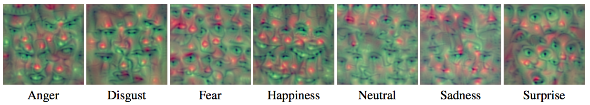

###Learning Grimaces By Watching TV

By Samuel Albanie and Andrea Vedaldi

This repo contains MATLAB code to reproduce the experiments contained in
the paper [Learning Grimaces By Watching TV](http://www.robots.ox.ac.uk/~albanie/publications/albanie16learning.pdf).

--

The code is organised as follows:

* `fer-exps` contains the experiments used to produce the benchmarks in
**Table 2** of the paper
* `sfew-exps` contains the experiments used to produce the benchmarks in
**Table 3** in the paper
* `facevalue-exps` contains the experiments used to produce **Table 4** of
the paper
* `core` contains shared code used by each of the experiments

**Dependencies**: This code requires the MatConvNet framework which you can
get from [here](https://github.com/vlfeat/matconvnet).

**Datasets**: The experiments in this paper use three datasets:

* The **FER** dataset is a publicly accessible dataset that contains about
35,000 emotion labelled faces (available
[here](https://www.kaggle.com/c/challenges-in-representation-learning-facial-expression-recognition-challenge/data))
* The **SFEW** dataset is a dataset that is freely available for research use.
It contains about 1,500 emotion labelled faces (available
[here](https://cs.anu.edu.au/few/emotiw2015.html))
* The **facevalue** dataset is a dataset that is freely available for research
use, released alongside the paper. It contains about 192,000 event labelled
faces (available
[here](http://www.robots.ox.ac.uk/~vgg/data/facevalue)). Some example face
tracks are shown below:

**Emotion recognition model visualizations**

The network inversions shown in Figure 2 of the paper (and reproduced below)
were produced by applying Aravindh Mahendran's *deep goggle* code (which can
be found [here](https://github.com/aravindhm/deep-goggle)) to the VGG-VD-16
model trained on FER.

